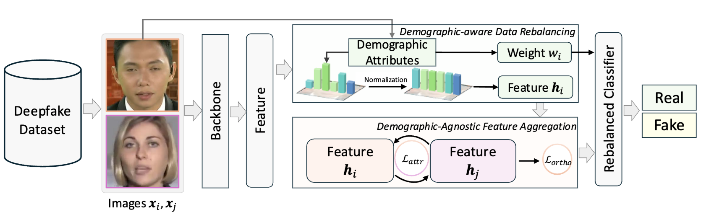

# Official Code Implementation for the 🥈Runner-Up Solution in the Competition of Fairness in AI Face Detection (NeurIPS 2025)

This repository contains the official code implementation for our solution to [the Competition on Fairness in AI Face Detection](https://sites.google.com/view/aifacedetection/home).

Fundamentally, the methodology employed directly leverages the work presented in our NeurIPS paper “[Fair Deepfake Detector Can Generalize](https://openreview.net/pdf?id=p27bSdc3FS).” (Codebase: [DAID](https://github.com/xaCheng1996/DAID)). For comprehensive technical details, readers are encouraged to consult our dedicated [technical report](https://drive.google.com/file/d/1E37ILmKQ882cXBYhK3DbHk4XdDCNekMv/view?usp=sharing) or the [full-length paper](https://openreview.net/pdf?id=p27bSdc3FS).

# Overview



As illustrated in Figure, DAID integrates two components into a standard detector architecture before the classifier head: i) Demographic-aware Data Rebalancing, which mitigates data distribution confounding (DD) by balancing the contribution of demographic subgroups through sample-wise reweighting and feature-space normalization. ii) Demographic-agnostic Feature Aggregation, which neutralizes model-capacity confounding (MC) by enforcing representation invariance across demographic groups using pairwise feature alignment and orthogonal subspace projection.

# Quick Start

The model trained with AIFace Dataset can be obtained  from [this url](https://drive.google.com/file/d/1AyWAykiCi3CWDHnj1xV_OYSq7qPaPC3k/view?usp=sharing).

Then simplely run:

```
python train_efficientnet.py
```

# Reference

If you find our work is useful, kindly cite it as:

```
@article{cheng2025fair,
  title={Fair Deepfake Detectors Can Generalize},
  author={Cheng, Harry and Liu, Ming-Hui and Guo, Yangyang and Wang, Tianyi and Nie, Liqiang and Kankanhalli, Mohan},
  journal={arXiv preprint arXiv:2507.02645},
  year={2025}
}
```

or

```
@inproceedings{cheng2025fair,
  title={Fair Deepfake Detectors Can Generalize},
  author={Cheng, Harry and Liu, Ming-Hui and Guo, Yangyang and Wang, Tianyi and Nie, Liqiang and Kankanhalli, Mohan},
  booktitle={NeurIPS},
  year={2025}
}
```

